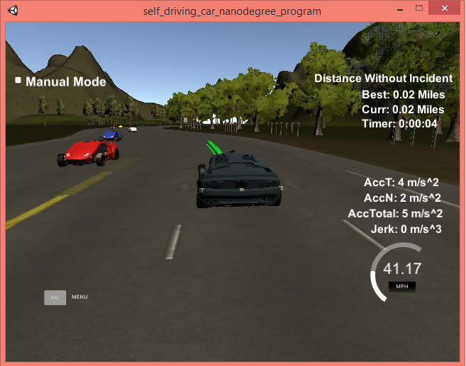
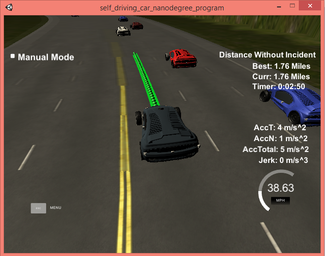
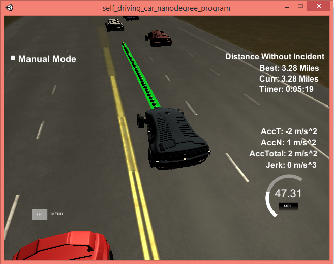
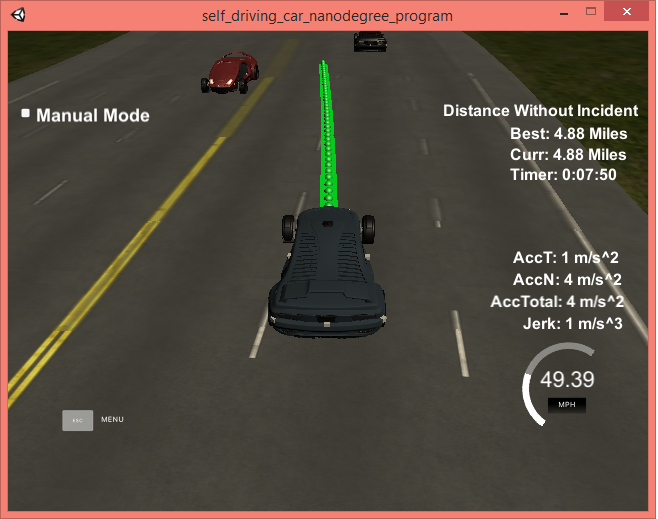
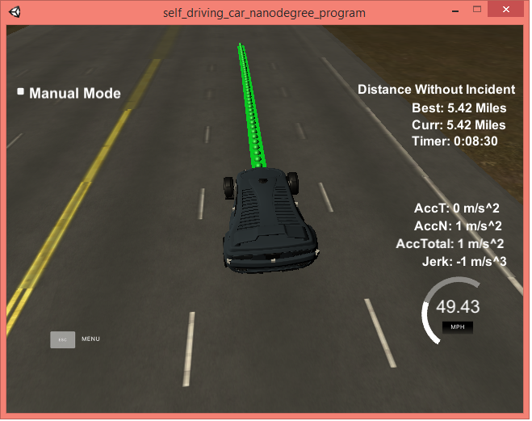

# CarND-Path-Planning-Project
***
## Objective
The objective of the project is to drive a car on a highway (simulator)without colliding with other cars and if necessary, overtaking other cars by changing lanes while maintaining the speed limit, acceleration and jerk.
***

### Snapshots from simulator

***

## Rubric Points
### Compilation
I have used **spline** library by including **spline.h** in source folder. Code compiles correctly using *cmake* without any errors.

### Valid trajectories

|   CRITERIA	| RESULT   	|
|:---	|:---	|
|   **The car is able to drive at least 4.32 miles without incident.**	|  I ran the simulator for more than 5 miles without incidents. 	|
| **The car drives according to the speed limit.**  	|   No speed limit warning message was seen.	|
| **Max Acceleration and Jerk are not Exceeded.**  	|   Max jerk red message was not seen.	|
|  **Car does not have collisions.**	|   No collisions.	|
| **The car stays in its lane, except for the time between changing lanes.**  	|   The car stays in its lane most of the time other than when it changes lane because of traffic.	|
| **The car is able to change lanes**  	|  The car change lanes when the there is a slow car in front of it, and it is safe to change lanes i.e. no other car is within safe distance.	|
***
### Reflection

#### Model description

Simulator sends data in JSON format and is listened in main.cpp. Data contains Car's coordinate, speed, velocity, yaw rate and Frenet coordinates. Simulator also returns data from sensors which contains data of other cars.

Our model for Path Planning can be broken down in three modules

* **Prediction**
Sensor fusion and simulator data is used to predict the behavior of moving objects. eg. If there is another car in front of us, what will be its next move, will it stop, or turn or speedup. Based on this we decide how we react.

* **Behavior Planning**
Based on the prediction of the situation we are in, we change(increase / decrease) speed, or make a lane change when it is safe. If there is a car in front of us, we reduce our speed. If we can change our lane (while maintain speed limits) to overtake a car obstructing our route, we switch lanes to either left or right. If we are going slower than max speed permissible and there are no obstructions in our lane, we increase our speed till safer limits and so on.
We have used buffer distance of **30.0 meters** as a safe distance between us and a car in front of us and a distance of **10.0 meters** as a safe distance between us and a car behind us during lane change.
We accelerate/de-accelerate at a rate of **0.2 meters per second** during speed change.

* **Trajectory Generation**
 Our car generates the trajectory based on the speed, position, lane, car coordinates and past path points. To make trajectory smooth we use two points from the previous trajectory. If there are no previous points then we calculate the previous points from the current yaw and current car coordinates.  Then we add there points by adding a distance (s) of 30, 60, 90 meters to trajectory. All these points are shifted to car reference angle.
 Here we use **spline** library to generate smooth waypoints. A total of 50 waypoints are generate including all previously untraversed one. Then all these points are transformed to global coordinates and send to simulator. This process repeats making car move ahead in trajectory.
 